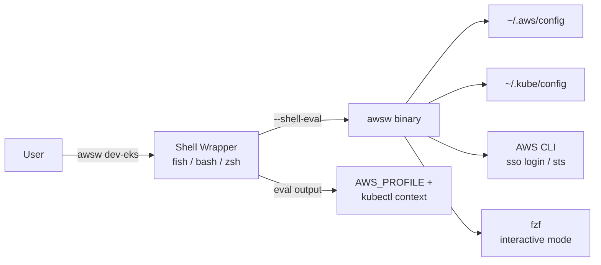

# awsw — AWS Account & EKS Context Switcher


[](https://github.com/smeltery/awsw/actions/workflows/ci.yml)
[](https://github.com/smeltery/awsw/actions/workflows/release.yml)
[](https://goreportcard.com/report/github.com/smeltery/awsw)
[](https://opensource.org/licenses/MIT)


A lightweight CLI for seamlessly switching between AWS SSO accounts and EKS cluster contexts. The primary workflow is: switch AWS account → switch kubectl context → use `k9s` / `kubectl` against the right cluster immediately.

## Configuration

`awsw` reads its configuration from `~/.config/awsw/config.yaml`. If the file does not exist, built-in defaults are used.

### Config file format

```yaml
sso:
  start_url: https://d-1234567890.awsapps.com/start/#
  region: us-east-1
  session_name: default
  registration_scopes: sso:account:access
default_region: us-east-1
profiles:
  - alias: dev-ro
    account_name: dev
    account_id: "111111111111"
    role_name: ReadOnlyAccess
  - alias: dev-eks
    account_name: dev
    account_id: "111111111111"
    role_name: eng-eks
    has_eks: true
  - alias: it-eks
    account_name: staging
    account_id: "222222222222"
    role_name: eng-eks
    has_eks: true
  - alias: prod-ro
    account_name: production
    account_id: "333333333333"
    role_name: ReadOnlyAccess
```

### `awsw config init`

Scaffolds a config file with the built-in defaults:

```
$ awsw config init
✓ Wrote default config to ~/.config/awsw/config.yaml
Edit the file to customize your profiles and SSO settings.
```

Refuses to overwrite an existing file unless `--force` is passed.

### Adding or removing profiles

Edit `~/.config/awsw/config.yaml` directly. No rebuild required — changes take effect on the next `awsw` invocation.

## Default Accounts & Roles

The built-in defaults (used when no config file exists) include:

| Alias | Account Name | Account ID | Role | EKS Cluster |
|---|---|---|---|---|
| `dev-ro` | dev | `111111111111` | ReadOnlyAccess | — |
| `dev-eks` | dev | `111111111111` | eng-eks | yes |
| `it-eks` | staging | `222222222222` | eng-eks | yes |
| `prod-ro` | production | `333333333333` | ReadOnlyAccess | — |

SSO Configuration:
- Start URL: `https://d-1234567890.awsapps.com/start/#`
- SSO Region: `us-east-1`

## Commands

### `awsw` (no arguments)

Interactive mode. Presents a fuzzy-searchable list via `fzf`. For profiles with EKS clusters, each cluster is listed as a separate selectable line (keyed by cluster context alias). On selection:

1. Exports `AWS_PROFILE` in the current shell.
2. If the selected entry is a cluster, switches the kubectl context to that cluster.

### `awsw <alias-or-cluster>`

Switch directly by profile alias **or** EKS cluster name. Resolution order:

1. Exact match on profile alias (e.g. `awsw dev-eks`, `awsw prod-ro`)
2. Exact match on EKS cluster context alias (e.g. `awsw my-cluster-dev`)
3. Exact match on EKS cluster name

When matched by cluster name, the owning profile's `AWS_PROFILE` is set and the kubectl context is switched to that specific cluster.

### `awsw login`

Authenticates the shared SSO session. Before opening the browser, checks if the session is already valid via `aws sts get-caller-identity`. If authenticated, prints a message and exits. Use `--force` to re-authenticate regardless.

A single login grants access to all accounts/roles.

### `awsw status`

Prints:
- Current `AWS_PROFILE`
- Output of `aws sts get-caller-identity`
- Current kubectl context (`kubectl config current-context`)

### `awsw setup`

First-time (or refresh) setup. Performs two things:

1. **AWS config generation** — writes/updates `~/.aws/config` with the `sso-session` block and one `[profile ...]` per account/role combo (see [AWS Config Generation](#aws-config-generation)).
2. **Kubeconfig population** — for each `eng-eks` role, runs `aws eks list-clusters` to discover clusters, then runs `aws eks update-kubeconfig --name <cluster> --region <region> --profile <profile> --alias <friendly-name>` to populate `~/.kube/config` with human-friendly context names.

## AWS Config Generation

`awsw setup` generates the following `~/.aws/config`:

```ini
[sso-session default]
sso_start_url = https://d-1234567890.awsapps.com/start/#
sso_region = us-east-1
sso_registration_scopes = sso:account:access

[profile dev-ro]
sso_session = default
sso_account_id = 111111111111
sso_role_name = ReadOnlyAccess
region = us-east-1

[profile dev-eks]
sso_session = default
sso_account_id = 111111111111
sso_role_name = eng-eks
region = us-east-1

[profile it-eks]
sso_session = default
sso_account_id = 222222222222
sso_role_name = eng-eks
region = us-east-1

[profile prod-ro]
sso_session = default
sso_account_id = 333333333333
sso_role_name = ReadOnlyAccess
region = us-east-1
```

If `~/.aws/config` already exists, `awsw setup` backs it up to `~/.aws/config.bak` before writing.

## EKS / Kubernetes Integration

Each `eng-eks` role maps to one or more EKS clusters. The mapping is discovered automatically during `awsw setup` via `aws eks list-clusters`.

Kubeconfig contexts use short, human-friendly aliases rather than the default long ARN-based names:

```
dev-eks       → clusters in account 111111111111
it-eks        → clusters in account 222222222222
```

If an account has multiple clusters, the alias is `<account-alias>-<cluster-name>` (e.g. `dev-eks-my-cluster`). If there is exactly one cluster, the alias is just the account alias (e.g. `dev-eks`).

On switch (`awsw dev-eks`), the tool:
1. Exports `AWS_PROFILE=dev-eks`
2. Runs `kubectl config use-context dev-eks`

This means `k9s`, `kubectl`, `helm`, and any other kube-aware tool immediately targets the correct cluster.

## Shell Integration

`AWS_PROFILE` must be set in the **current** shell process, not a subshell. To achieve this, `awsw` uses an `init` command that emits a shell wrapper function, similar to how `direnv`, `mise`, and `starship` handle this.

### Setup

Add one of the following to your shell rc file:

**fish** (`~/.config/fish/config.fish`):
```fish
awsw init fish | source
```

**bash** (`~/.bashrc`):
```bash
eval "$(awsw init bash)"
```

**zsh** (`~/.zshrc`):
```zsh
eval "$(awsw init zsh)"
```

### How it works

`awsw init <shell>` outputs a shell function named `awsw` that:

1. Calls the underlying `awsw` binary with a `--shell-eval` flag.
2. The binary performs the selection logic and prints shell commands to stdout (e.g. `export AWS_PROFILE=dev-eks` for bash/zsh or `set -gx AWS_PROFILE dev-eks` for fish).
3. The wrapper function `eval`s the output, setting variables in the current shell.

For commands that don't need env var changes (`status`, `login`, `setup`), the binary executes directly without eval.

## Dependencies

- **AWS CLI v2** — SSO login, EKS kubeconfig updates, STS identity checks.
- **kubectl** — context switching, kubeconfig management.
- **fzf** — interactive fuzzy selection.

## Installation

1. Install the `awsw` binary (e.g. via `go install`, Homebrew, or copying to a directory on `$PATH`).
2. Add the shell init hook (see [Shell Integration](#shell-integration)).
3. Run `awsw setup` to generate AWS config and kubeconfig.
4. Run `awsw login` to authenticate.

## Architecture



## Implementation Language

**Go**. Single static binary with no runtime dependencies. Cross-compiles to macOS (arm64/amd64) and Linux.

Key libraries:
- **`github.com/spf13/cobra`** — command/subcommand routing (`awsw`, `awsw login`, `awsw setup`, etc.)
- **`gopkg.in/yaml.v3`** — parse and write the YAML config file (`~/.config/awsw/config.yaml`)
- **`os/exec`** — shell out to `aws`, `kubectl`, and `fzf`
- **`text/template`** — generate `~/.aws/config` INI and shell init functions
- **`encoding/json`** — parse AWS CLI JSON output (`sts get-caller-identity`, `eks list-clusters`)
- **Standard library `testing`** — unit tests with table-driven patterns and interface-based mocks

## Testing Strategy

Target: **≥ 80% code coverage**. Tests must not require real AWS credentials or network access.

### Unit Tests

All core logic is tested by injecting interfaces/mocks for external dependencies (AWS CLI, kubectl, fzf, filesystem).

| Area | What to test | Mocking approach |
|---|---|---|
| **Config loading** | Load from YAML, fallback to defaults when no file, invalid YAML error, save/load round-trip | Temp directory with fixture files |
| **Config generation** | Correct INI output for all 4 profiles; backup of existing config | Mock filesystem reads/writes |
|| **Alias/cluster resolution** | Valid alias → profile; cluster name → profile+cluster; invalid → error with hints | Pure logic, no mocks needed |
| **Shell output** | `--shell-eval` emits correct syntax per shell (fish `set -gx` vs bash/zsh `export`) | Assert on stdout strings |
| **Kube context switching** | Correct `kubectl config use-context` call; no-op for non-EKS roles | Mock command executor |
| **EKS discovery** | Single cluster → simple alias; multiple clusters → compound alias; zero clusters → error | Mock `aws eks list-clusters` JSON response |
| **`init` command** | Emits valid fish/bash/zsh function source code | Assert on stdout, optionally syntax-check with `fish -n` / `bash -n` |
| **`status` command** | Formats STS identity + kube context; handles missing profile gracefully | Mock STS + kubectl responses |
|| **`login` command** | Invokes `aws sso login` with correct `--sso-session`; skips when already authenticated; `--force` overrides; surfaces errors | Mock command executor |

### Integration Tests

Run against a temporary `$HOME` with isolated `~/.aws/config` and `~/.kube/config`:

- **`setup` → `switch` round-trip**: run `awsw setup` with mocked AWS responses, then `awsw dev-eks`, assert env vars and kube context are set.
- **Shell eval correctness**: for each shell (fish, bash, zsh), run `awsw init <shell>` output through the real shell interpreter and verify `AWS_PROFILE` is set.

### What is NOT tested

- Real SSO authentication (requires browser interaction).
- Real EKS cluster connectivity.
- fzf interactive UI (tested manually).

### CI

Tests run on every push. Coverage is measured and enforced at ≥ 80% via the CI pipeline. Coverage reports are generated per module.

## GitHub Actions

Two workflows: **CI** (every push/PR) and **Release** (on version tags).

### CI — `.github/workflows/ci.yml`

Triggered on push to `main` and all pull requests.

**Jobs:**

1. **test**
   - Matrix: `go: [stable]`, `os: [ubuntu-latest, macos-latest]`
   - Steps: checkout → setup Go → `go vet ./...` → `go test -race -coverprofile=coverage.out ./...` → enforce ≥ 80% coverage → upload coverage artifact

2. **lint**
   - Uses `golangci/golangci-lint-action`
   - Runs `golangci-lint run`

3. **build**
   - Runs `go build -o awsw .` to verify the binary compiles
   - Runs on both macOS and Linux

### Release — `.github/workflows/release.yml`

Triggered on tags matching `v*` (e.g. `v0.1.0`).

Uses [GoReleaser](https://goreleaser.com) to build, package, and publish.

**Steps:** checkout (with `fetch-depth: 0`) → setup Go → run GoReleaser (`goreleaser/goreleaser-action`)

**GoReleaser config** (`.goreleaser.yaml`):

```yaml
builds:
  - binary: awsw
    goos: [darwin, linux]
    goarch: [amd64, arm64]
    ldflags:
      - -s -w -X main.version={{.Version}}

brews:
  - repository:
      owner: smeltery
      name: homebrew-tap
    name: awsw
    homepage: https://github.com/smeltery/awsw
    description: Seamlessly switch between AWS SSO accounts and EKS contexts
    license: "MIT"
    install: |
      bin.install "awsw"
    test: |
      system "#{bin}/awsw", "--version"

archives:
  - formats: [tar.gz]
    name_template: "{{ .ProjectName }}_{{ .Os }}_{{ .Arch }}"

checksum:
  name_template: checksums.txt

changelog:
  sort: asc
  filters:
    exclude:
      - "^docs:"
      - "^chore:"
```

On each tagged release, GoReleaser:
1. Cross-compiles for macOS (arm64/amd64) and Linux (amd64/arm64).
2. Creates GitHub Release with binaries and checksums.
3. Pushes a Homebrew formula to `smeltery/homebrew-tap`, enabling:

```
brew tap smeltery/tap
brew install awsw
```

## Example Workflows

### First-time setup

```
$ awsw setup
✓ Backed up ~/.aws/config to ~/.aws/config.bak
✓ Wrote 4 profiles to ~/.aws/config
✓ Discovering EKS clusters...
  dev-eks: found cluster "main" in us-east-1
  it-eks: found cluster "tools" in us-east-1
✓ Updated ~/.kube/config with 2 contexts

$ awsw login
Opening browser for SSO authentication...
✓ Logged in to SSO session "default"
```

### Daily switching

```
# Switch by profile alias
$ awsw dev-eks
→ AWS_PROFILE=dev-eks
→ kubectl context: my-cluster-dev
Ready.

# Or switch by cluster name directly
$ awsw my-cluster-staging
→ AWS_PROFILE=it-eks
→ kubectl context: my-cluster-staging
Ready.

$ k9s
# (opens k9s connected to the correct cluster)

$ kubectl get nodes
# (shows nodes in the staging cluster)
```

### Interactive selection

EKS profiles show one line per cluster, non-EKS profiles show one line per profile:

```
$ awsw
  dev-ro                dev (111111111111) ReadOnlyAccess
  my-cluster-dev        dev (111111111111) eng-eks
> my-cluster-staging    staging (222222222222) eng-eks
  prod-ro               production (333333333333) ReadOnlyAccess

→ AWS_PROFILE=it-eks
→ kubectl context: my-cluster-staging
Ready.
```

### Check current state

```
$ awsw status
AWS Profile:  dev-eks
Account:      111111111111
Role:         eng-eks/nicholas
Kube Context: dev-eks
```
