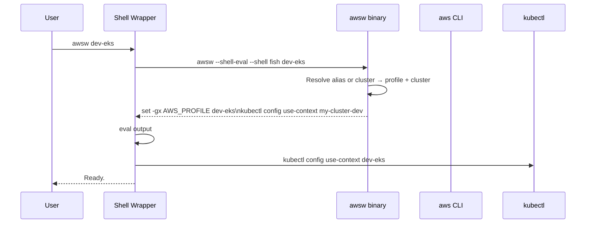
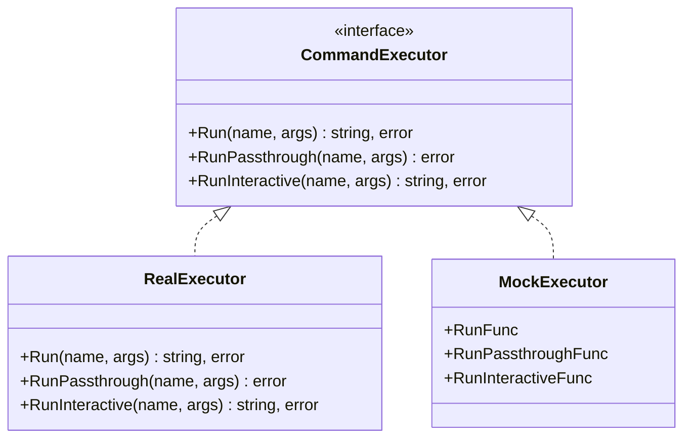

# Architecture

## Overview

`awsw` is a single Go binary that orchestrates AWS CLI, kubectl, and fzf to switch between AWS SSO accounts and EKS cluster contexts. It does not call AWS APIs directly — it shells out to `aws`, `kubectl`, and `fzf` via a `CommandExecutor` interface.

Because `AWS_PROFILE` must be set in the user's **current** shell process (not a subshell), the binary cannot set it directly. Instead, it outputs shell commands to stdout, and a thin shell wrapper function `eval`s them.

## Request Flow



## Package Structure

```
awsw/
├── main.go                 # Entry point, version injection
├── cmd/                    # Cobra commands
│   ├── root.go             # Switch command (default), fzf interactive, --shell-eval
│   ├── init.go             # `awsw init <shell>` — emit shell wrapper function
│   ├── login.go            # `awsw login` — aws sso login passthrough
│   ├── status.go           # `awsw status` — current profile + identity + context
│   └── setup.go            # `awsw setup` — config generation + EKS discovery
├── internal/
│   ├── config/             # Profile registry, AWS config generation
│   │   ├── profiles.go     # Profile type, hardcoded account registry, alias lookup
│   │   └── awsconfig.go    # ~/.aws/config INI template + file write/backup
│   ├── exec/               # Command execution abstraction
│   │   └── executor.go     # CommandExecutor interface + RealExecutor
│   └── shell/              # Shell-specific output
│       └── shell.go        # ExportEnv(), InitScript(), ParseShell()
```

## Key Design Decisions

### Shell wrapper via `init`

The `awsw init <shell>` pattern (used by direnv, mise, starship) was chosen over:
- **Sourcing a script directly** — harder to update, path issues
- **Writing to a temp file** — race conditions, cleanup burden
- **Using `direnv`-style `.envrc`** — too implicit, not per-command

The init command outputs a function that wraps the binary. Commands that modify env vars (`awsw <alias>`) go through eval. Commands that don't (`login`, `status`, `setup`) run the binary directly.

### CommandExecutor interface

All external commands go through the `CommandExecutor` interface:



Three methods serve different execution needs:
- **`Run`** — capture stdout (JSON parsing, context names)
- **`RunPassthrough`** — connect stdin/stdout/stderr to terminal (SSO login, kubeconfig update)
- **`RunInteractive`** — TTY access + capture stdout (fzf selection)

### Hardcoded profile registry

Profiles are defined as a Go slice rather than read from a config file. This is intentional:
- The account list changes rarely (org-level change)
- Eliminates a config file format, parser, and validation
- Single source of truth compiled into the binary
- Adding/removing a profile is a one-line code change + release

### EKS context aliasing

Kubeconfig contexts get human-friendly aliases instead of the default ARN-based names. The aliasing logic handles two cases:
- **Single cluster per account** → alias matches the profile alias (e.g. `dev-eks`)
- **Multiple clusters per account** → alias is `<profile>-<cluster-name>` (e.g. `dev-eks-main`)

This keeps `awsw dev-eks` and `kubectl config use-context dev-eks` consistent.
